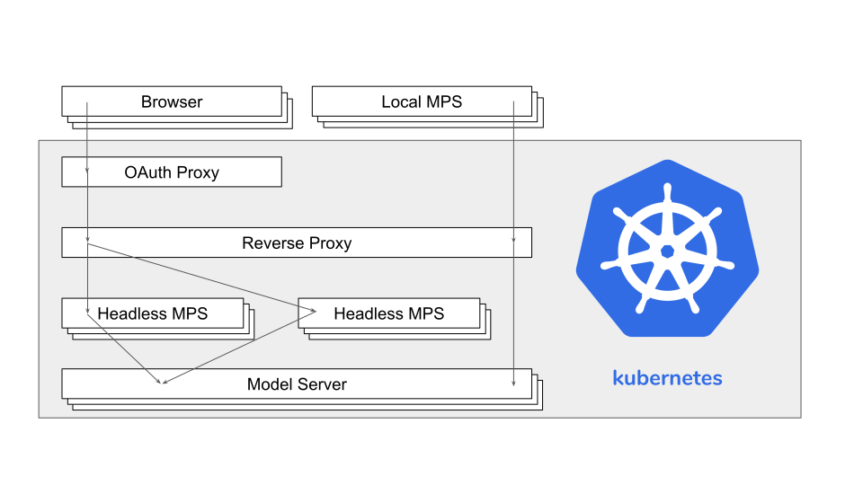

# Architecture

The image above shows the components that Modelix currently consists of.

MPS is running in headless mode on the server with an HTTP server installed as a plugin.
The browser connects to that server and receives the HTML and JavaScript code required for the interactive model editor.

A second plugin connects to a model server and replicates the data into MPS' internal module repository.
All MPS instances connected to that model server will stay synchronized.
This can also be a local MPS instance without a web editor.
Both options are supported at the same time.

The next image gives an overview over the different docker images running in the kubernetes cluster.

The model server uses an Apache Ignite cluster and just provides a REST API on top of it.
A high load can be distributed over multiple instances.

Running multiple MPS instances for scalability is possible,
because the model has the same state on all instances.

If you want to run MPS instances with different configurations (languages, plugins)
or allow external instances to connect to the model server,
a reverse proxy is used to forward the request to the correct instance.

To access the web editor a user has to login in with a google account first.
An OAuth proxy takes care of that and adds an HTTP header with the users e-mail address to the request.

## Editor
Modelix provides an editor in the browser for the languages implemented in MPS.
This can be an image based editor that renders the editor in MPS using the default editor definition
or an HTML based editor that requires a separate editor definition in a language provided by Modelix.

Common to both approaches is that the user input (keyboard, mouse) is processed on the server
and the update of the projection after a model change also happens on the server.
Even in case of the HTML based editor the resulting HTML is computed on the server side.
This removes the need to replicate the model into the browser, which would result in a bad performance in case of big models.

## Model

Running MPS in the cloud requires an alternative to the file system for storing models.
Modelix implements a data structure that allows replication between all MPS instances connected to the same model server.
It is very similar to the [git storage format](https://git-scm.com/book/en/v2/Git-Internals-Git-Objects),
but instead of files it stores nodes in its key-value data store.

To support realtime collaboration, in addition to the snapshot of a version it also stores the operations that were applied on the previous version to produce the new version.
Conflicts between concurrent modification are resolved using [operational transformation](https://en.wikipedia.org/wiki/Operational_transformation) (OT).
The usually hard part of OT is to guarantee convergence, meaning that all clients end up with the same result indepent of the order in which they receive changes.
This problem becomes trivial, because versions are identified by a hash over all the content.
Any divergence will result in a different hash which can easily be detected.

The remaining problem is what to do when a divergence is detected.
From git we know that switching between versions is fast, because it only has to apply the difference between these versions.
The same is true here.
Fixing a divergence is as easy as switching to the correct version.
If a client doesn't have any local changes it doesn't even need to apply the change operations itself.
It can just switch to the new version.
So in the rare case of a divergence fixing it is nothing special.
It's an operation that happens all the time.
